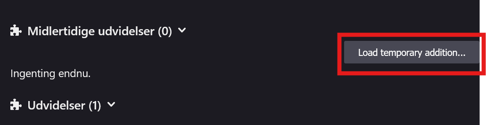

# Browser compatibility
| **Browser**        | **Manifest V2**         | **Manifest V3**         | **Notes**                                  | **Recommended to Use**        |
|--------------------|--------------------------|---------------------------|----------------------------------------------|-------------------------------|
| **Chrome**         | ❌ (deprecated)           | ✅ Full support            | MV2 nearly removed                           | ✅ **Manifest V3**             |
| **Edge**           | ⚠️ (phasing out)          | ✅                         | Follows Chrome                               | ✅ **Manifest V3**             |
| **Firefox**        | ✅ Supported              | ✅ Supported              | Maintains more powerful APIs in MV2          | ✅ **Manifest V2 (preferred)** |
| **Opera**          | ⚠️ Supported              | ✅                         | Tracks Chromium updates                      | ✅ **Manifest V3**             |
| **Brave**          | ✅ Supported              | ✅                         | May keep MV2 longer                          | ✅ **Manifest V2 or V3**       |
| **Vivaldi**        | ✅ Supported              | ✅                         | Similar to Brave                             | ✅ **Manifest V2 or V3**       |
| **Safari**         | ❌ (Not MV2)              | ⚠️ Partial MV3            | Apple’s own system                           | ⚠️ **Partial MV3**             |
| **Pale Moon etc.** | ✅ (legacy systems)       | ❌                         | Old-style extensions                         | ⚠️ **Manifest V2 only**        |

Manual Installation (Developer Mode)
If you prefer to install the extension manually or are testing a development version, follow these steps:

Download or Clone the Repository:

Download the ZIP file from the repository :
Extract the Files:
If you downloaded a ZIP file, extract it to a convenient location.

## For chrome
Open Chrome Extensions Page:
In Chrome, navigate to: chrome://extensions/
Enable Developer Mode:
Toggle the Developer mode switch in the top right corner.

Load Unpacked Extension:
Click the Load unpacked button and select the folder where your extension files are located.

Verify Installation:
Once loaded, the extension should appear in your list of extensions. You can now pin it to the toolbar for easy access.

## For Firefox
In Firefox, navigate to:  about:debugging#/runtime/this-firefox

Navigate to:
instergramAno\src\dist-v2

Click on the manifest.json file and the extension should be loaded
